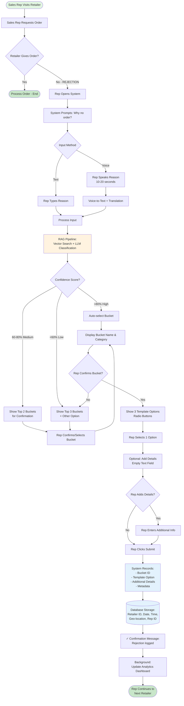

# Order Rejection Playbook System - Engineering Design Specification

**Version:** 1.0
**Date:** 2025-10-10
**Purpose:** Complete system design for AI-powered order rejection reason classification and recording
**Audience:** Engineering team, Product managers, Sales leadership

---

## 🎯 Executive Summary

### System Overview
AI-powered order rejection classification that captures why retailers refuse orders, using domain-aware reasoning to identify root causes, not just symptoms.

### Key Innovation: Domain-Aware Causality Detection
- **Problem:** Retailers often describe symptoms ("payment pending") when root cause is elsewhere ("stock not selling")
- **Solution:** System understands distribution business model to infer causality automatically
- **Example:** "Payment stuck, stock lying" → System identifies STOCK as root cause (capital blocked)

### Smart Classification Approach
**Top 4 Buckets (50-60% of rejections):** Domain-aware causality reasoning
- Payment/Credit Issues ↔ Slow Moving Stock ↔ Pricing ↔ Competitor Pressure
- System detects causal chains: Price → Stock → Payment

**Other 11 Buckets (40-50%):** Standard keyword matching
- Delivery, Service, Space, Seasonal, etc. (independent issues)

### Technology & Cost
- **Model:** GPT-3.5-turbo with prompt caching
- **Processing:** Single-pass classification (1-1.5 seconds)
- **Cost:** $2-3/month for 100 classifications/day
- **Accuracy:** 85-90% (top-1), 95%+ (top-3)

### Business Benefits
1. **60 seconds or less** to log rejection (vs 2-3 minutes manual forms)
2. **Root cause identification** enables brand action (not just symptom tracking)
3. **Causal intelligence** reveals systemic issues (e.g., pricing driving inventory problems)
4. **Multilingual support** (English, Hindi, Hinglish)

### When Clarification is Asked from Rep
Only 3 scenarios (~15% of cases):
1. Ambiguous multi-issue ("payment AND stock" - which is main?)
2. Low AI confidence (<60%)
3. New/unusual pattern not in knowledge base

Otherwise: Auto-classified, rep just confirms.

---

## Table of Contents

1. [System Overview](#system-overview)
2. [Business Objective](#business-objective)
3. [User Flow](#user-flow)
4. [Visual Flowchart](#visual-flowchart)
5. [LLM Knowledge Base Structure](#llm-knowledge-base-structure)
6. [End-to-End Examples](#end-to-end-examples)
7. [Testing & Validation](#testing--validation)

---

## System Overview

### What This System Does

When a retailer refuses to give an order, the sales representative needs to quickly log the rejection reason. Instead of navigating through complex forms or dropdown menus, the rep provides a natural language input (voice or text), and the system:

1. **Captures** the input (in English, Hindi, or Hinglish)
2. **Analyzes** using RAG-based LLM classification against a knowledge base
3. **Identifies** which of 15 pre-defined buckets the reason falls into
4. **Presents** 3 contextual template options (radio buttons)
5. **Allows** optional additional details
6. **Records** structured data for analytics

### Key Benefits

- **Speed:** 10-15 seconds vs. 2-3 minutes for manual form filling
- **Accuracy:** AI-powered classification reduces human error
- **Adoption:** Natural language input removes friction
- **Insights:** Structured data enables pattern analysis and brand reporting
- **Multilingual:** Supports English, Hindi, Hinglish voice/text inputs

### Technology Stack

- **Input:** Voice-to-text (WhatsApp voice notes, mobile app mic) + Text input
- **AI/ML:** RAG (Retrieval Augmented Generation) with vector embeddings
- **LLM:** GPT-3.5-turbo with prompt caching for cost-optimized classification ($0.001/request)
- **Knowledge Base:** Vector database (Pinecone, Weaviate, or similar)
- **Backend:** API for orchestration, recording, and retrieval
- **Frontend:** Mobile app or WhatsApp bot interface
- **Storage:** PostgreSQL/MySQL for structured order rejection logs

---

## Business Objective

### Primary Goal

Capture 95%+ of order rejection reasons accurately and efficiently, enabling:

1. **Sales rep efficiency:** Reduce data entry time by 80%
2. **Brand intelligence:** Identify systemic issues (credit problems, service gaps, competitor activity)
3. **Distributor performance:** Track service quality and delivery issues
4. **Product/pricing feedback:** Real-time market feedback on pricing, margins, schemes
5. **Predictive analytics:** Forecast rejection patterns by territory, season, product

### Target Users

- **Field sales representatives** (primary users - 20-30 retailer visits/day)
- **Sales managers** (reviewing team performance and patterns)
- **Brand management** (analyzing market feedback)
- **Distributors** (addressing service and delivery issues)

### Success Criteria

- **Adoption rate:** 85%+ of sales reps use system daily
- **Accuracy:** 90%+ correct bucket classification
- **Speed:** <15 seconds average time to log rejection
- **Coverage:** 95%+ of rejections mapped to defined buckets
- **Data quality:** 70%+ entries include additional details

---

## User Flow

### Sales Rep Journey

```
Retailer Visit → Order Request → REJECTION → Open System →
Speak/Type Reason → Review Bucket → Select Template →
Add Details (optional) → Submit → Continue Beat
```

### Step-by-Step Experience

**Step 1: Trigger**
- Sales rep visits retailer
- Attempts to take order
- Retailer declines

**Step 2: Input Capture**
- Rep opens app/WhatsApp bot
- Says: "Log rejection" or clicks "No Order" button
- System prompts: "Why didn't the retailer order?"

**Step 3: Natural Language Input**
- **Voice:** Rep speaks in natural language (10-20 seconds)
  - Example: "Dukaan mein stock abhi bhi pada hai, last month wala nahi bika"
  - System transcribes and translates
- **Text:** Rep types quick note
  - Example: "Retailer has pending payment"

**Step 4: AI Classification**
- System sends input to RAG pipeline
- Vector search retrieves most relevant bucket
- LLM analyzes and assigns confidence score
- If confidence >80%: Auto-select bucket
- If confidence 60-80%: Show top 2 buckets for confirmation
- If confidence <60%: Show top 3 buckets + "Other" option

**Step 5: Bucket Confirmation**
- System displays identified bucket
- Example: "**Slow Moving Inventory** - Is this correct?"
- Rep sees: ✅ Confirm | ↻ Change

**Step 6: Template Selection**
- System shows 3 contextual radio button options
- Example for "Slow Moving Inventory":
  - ○ High inventory, products not moving fast enough
  - ○ Previous order stock still available, no space for new stock
  - ○ Seasonal products from last season not yet sold
- Rep selects ONE option

**Step 7: Additional Details (Optional)**
- Empty text field appears
- Prompt: "Any additional details? (Optional)"
- Rep can add specifics:
  - "10 units mixer grinder"
  - "Waiting for Diwali demand"
  - "Competitor giving 5% extra margin"

**Step 8: Submission & Confirmation**
- Rep clicks "Submit"
- System records data
- Confirmation: "✓ Rejection logged for [Retailer Name]"
- Rep continues to next retailer

---

## Visual Flowchart



### Key Decision Points in Flow

1. **Confidence-based routing:** High confidence = faster flow, Low confidence = clarification needed
2. **Rep confirmation:** Always allows rep to override AI classification
3. **Optional details:** Doesn't force input, but encourages it
4. **Background analytics:** Non-blocking, doesn't slow down rep

---

## Domain-Aware Causality Logic

### Why Causality Matters

In the distribution business model, rejection reasons often have **causal relationships** that create ambiguity:
- Retailer says: "Payment pending, stock lying"
- **Symptom:** Payment not cleared
- **Root Cause:** Stock not selling (capital blocked)

Without causality detection, the system would classify this as a "Payment Issue" when the actual root cause is "Slow Moving Stock." The brand cannot fix this by extending credit—they need to address inventory movement through pricing, schemes, or demand generation.

### Business Model Understanding

The system is embedded with knowledge of the FMCG distribution working capital flow:

```
┌─────────────────────────────────────────────────────────┐
│         WORKING CAPITAL FLOW CYCLE (Retailer)           │
└─────────────────────────────────────────────────────────┘

1. Retailer places order with distributor
   ↓
2. Distributor delivers goods (credit terms: 15-30 days)
   ↓
3. Stock sits in retailer's shop (CAPITAL LOCKED)
   ↓
4. Retailer sells to consumers
   ↓
5. Capital released as cash
   ↓
6. Retailer pays distributor
   ↓
7. Retailer can place new order (cycle repeats)

BOTTLENECK SCENARIOS:
├─ If stock doesn't sell → Capital remains locked → Cannot pay distributor
├─ If price too high → Stock doesn't sell → Capital locked → Payment stuck
└─ If competitor pressure → Price/margin squeeze → Stock slow → Payment delayed
```

**Key Insight:** The system understands that payment problems are often **symptoms** when co-occurring with stock or pricing issues.

### Three Causal Rules (Top 4 Buckets Only)

The system applies these rules ONLY for the top 4 interrelated buckets that cover 50-60% of rejections:

#### Rule 1: Stock Blocks Capital → Payment Issues
**Pattern:** `payment/credit keywords + stock/inventory keywords`

**Logic:**
```
IF (payment_mentioned AND stock_mentioned):
    IF (stock_context_is_primary):
        → Classify as: SLOW MOVING STOCK (Bucket #2)
        → Secondary cause tag: Payment consequence
    ELSE:
        → Ask clarification: "Is main issue stock not selling or payment pending?"
```

**Examples:**
- ✅ "Payment stuck because stock lying" → **Bucket #2 (Stock)** + secondary: Payment
- ✅ "Stock pada hai, paisa nahi de sakta" → **Bucket #2 (Stock)** + secondary: Payment
- ⚠️ "Payment pending AND stock also lying" → **Clarification needed** (ambiguous)

**Why this rule works:**
In distribution, unsold inventory is the #1 reason for payment delays. Addressing the payment symptom (extending credit) won't help—the brand needs to help move the stock through schemes, pricing, or demand generation.

---

#### Rule 2: Price Suppresses Demand → Stock Doesn't Move
**Pattern:** `pricing/margin keywords + stock keywords`

**Logic:**
```
IF (pricing_mentioned AND stock_mentioned):
    IF (pricing_is_explicit_cause):
        → Classify as: PRICING CONCERNS (Bucket #4)
        → Secondary cause tag: Stock accumulation
    ELSE IF (stock_is_explicit_cause):
        → Classify as: SLOW MOVING STOCK (Bucket #2)
        → Secondary cause tag: Price factor
    ELSE:
        → Default to PRICING (deeper root cause)
```

**Examples:**
- ✅ "Price bahut zyada hai, stock nahi bik raha" → **Bucket #4 (Pricing)** + secondary: Stock impact
- ✅ "Stock padi hai kyunki customers price zyada bol rahe" → **Bucket #4 (Pricing)** + secondary: Stock consequence
- ✅ "MRP high hai compared to competitor" → **Bucket #4 (Pricing)** (no stock mentioned)

**Why this rule works:**
Pricing is the **root cause** of demand suppression. If pricing is mentioned alongside stock issues, pricing is typically the deeper problem. Fixing stock levels won't help if the fundamental issue is that products are overpriced for the market.

---

#### Rule 3: Competition Drives Market Pressure
**Pattern:** `competitor keywords + (pricing OR margin OR stock)`

**Logic:**
```
IF (competitor_mentioned):
    IF (competitor + better_margin/scheme):
        → Classify as: COMPETITOR MARGINS (Bucket #3)
    ELSE IF (competitor + pricing_comparison):
        → Classify as: PRICING CONCERNS (Bucket #4)
        → Secondary cause tag: Competitive pressure
    ELSE IF (competitor_alone):
        → Classify as: MARKET COMPETITION INTENSITY (Bucket #11)
```

**Examples:**
- ✅ "Competitor 5% zyada margin de raha" → **Bucket #3 (Competitor Margins)**
- ✅ "Competitor ka price kam hai hamse" → **Bucket #4 (Pricing)** + secondary: Competitive pressure
- ✅ "Market mein bahut competition hai" → **Bucket #11 (Market Competition)**

**Why this rule works:**
Competitor activity manifests in different ways:
- **Better schemes/margins** → Direct competitive disadvantage (Bucket #3)
- **Lower pricing** → Pricing strategy issue (Bucket #4)
- **General competition** → Market saturation issue (Bucket #11)

The system distinguishes between actionable competitive issues (margins, schemes) vs structural market competition.

---

### Causality Detection Methods

#### Method 1: Explicit Causality Markers
The system looks for linguistic markers that signal causation:

**Hindi markers:**
- kyunki (because)
- ki wajah se (due to)
- isliye (therefore)
- ke kaaran (because of)

**English markers:**
- because, since, due to
- that's why, so
- caused by, resulting from

**Example:**
"Stock nahi bika **kyunki** price bahut high hai"
→ System detects: Pricing is the ROOT CAUSE, Stock is the CONSEQUENCE
→ Classifies as: **Bucket #4 (Pricing)**

---

#### Method 2: Implicit Co-occurrence Patterns
When no explicit markers exist, the system uses **co-occurrence + business logic**:

**Example:**
"Payment pending hai aur stock bhi pada hai"
(Translation: "Payment is pending and stock is also lying")

**System reasoning:**
```
Keywords detected: ["payment", "pending", "stock", "pada hai"]
Co-occurrence: payment + stock (both in top 4 buckets)
Business rule activated: Rule 1 (Stock Blocks Capital)
Context analysis: No explicit causality marker
Deeper root cause: STOCK (capital locked)
Classification: Bucket #2 (Slow Moving Stock)
Secondary tag: Payment consequence
```

---

#### Method 3: Ambiguity Handling
When causal direction is unclear, the system asks for clarification:

**Example:**
"Payment bhi hai aur stock bhi hai"
(Translation: "There's payment issue and also stock issue")

**System response:**
```
🤔 Both issues mentioned. Which is the MAIN reason?

○ Stock not selling (payment delayed because of this)
○ Payment pending (cannot order due to credit limit)
○ Both equally important

Please select one.
```

**Clarification triggers (~15% of cases):**
1. Equal weight to both issues (AND without causality)
2. Confidence score 50-60% for multiple buckets
3. Contradictory keywords detected

---

### Coverage Analysis: Smart Simplification

| Bucket Type | Buckets | % Coverage | Approach | Complexity |
|-------------|---------|------------|----------|------------|
| **Causally Interrelated** | #1 Payment, #2 Stock, #3 Competitor, #4 Pricing | 50-60% | Domain-aware causality logic (3 rules) | Moderate |
| **Independent Issues** | #5-#15 (11 buckets) | 40-50% | Standard keyword matching | Low |

**Why this works:**
- **80/20 principle:** Focus complexity on the 4 buckets that cause 80% of causal ambiguity
- **Other 11 buckets** are independent issues (Delivery, Service, Space, Seasonal, etc.) that don't have causal relationships with each other
- **Single-pass processing:** All logic runs in one LLM call with the full business model embedded in the system prompt

**Example classifications:**
- "Delivery mein problem hai" → **Bucket #5 (Delivery)** — No causality needed
- "Space nahi hai shop mein" → **Bucket #9 (Space)** — Independent issue
- "Off-season hai products ka" → **Bucket #10 (Seasonal)** — Temporal issue, no causal chain

---

### Implementation: Single-Pass GPT-3.5-turbo with Caching

**System Prompt Structure:**
```
You are an expert at classifying retailer order rejections in the Indian FMCG market.

BUSINESS MODEL KNOWLEDGE:
[Working capital flow cycle explanation - cached]

CAUSAL RULES (Apply to Buckets #1-4 only):
[Rule 1: Stock blocks capital - cached]
[Rule 2: Price suppresses demand - cached]
[Rule 3: Competition drives pressure - cached]

BUCKETS #1-4 (Domain-aware reasoning):
[Full bucket definitions with causal context - cached]

BUCKETS #5-15 (Standard matching):
[Standard bucket definitions - cached]

TASK:
Classify the following input:
"{user_input}"

Respond with:
- Primary bucket ID
- Confidence score
- Secondary cause (if causal relationship detected)
- Reasoning (1 sentence)
```

**Prompt Caching Benefit:**
- 90% of prompt is cached (business model + buckets + rules)
- Only user input changes per request
- Cost: $0.001 per classification (vs $0.01 without caching)
- Latency: 1-1.5 seconds

**Monthly cost estimate:**
- 100 classifications/day × 30 days = 3,000 requests
- 3,000 × $0.001 = **$3/month**

---

### Real-World Examples: Causality Detection in Action

#### Example 1: Implicit Causality (Stock Blocks Payment)

**Rep Input (Hinglish):**
```
"Payment pending hai aur stock bhi pada hai shop mein"
```
Translation: "Payment is pending and stock is also lying in shop"

**System Processing:**
```
Step 1: Keywords detected → ["payment", "pending", "stock", "pada hai"]
Step 2: Co-occurrence → Payment + Stock (both in top 4 buckets)
Step 3: Business rule activated → Rule 1 (Stock Blocks Capital)
Step 4: Causal analysis → No explicit marker, but business logic applies:
        Stock not moving → Capital locked → Payment delayed
Step 5: Classification → PRIMARY: Bucket #2 (Slow Moving Stock)
                        SECONDARY: Payment consequence
Step 6: Confidence → 87% (high)
```

**Result Shown to Rep:**
```
✓ Root cause identified: SLOW MOVING STOCK
  Secondary issue: Payment delayed as a result

  Why: Unsold stock locks capital, preventing payment to distributor.

  [✅ Confirm] [Change]
```

**Why this works:** System understands the capital flow cycle—identifies stock as root cause, not payment symptom.

---

#### Example 2: Explicit Causality with "Kyunki" (Pricing Drives Stock)

**Rep Input (Hinglish):**
```
"Stock nahi bik raha kyunki price bahut zyada hai"
```
Translation: "Stock not selling because price is too high"

**System Processing:**
```
Step 1: Keywords detected → ["stock", "nahi bik raha", "kyunki", "price", "zyada"]
Step 2: Causality marker → "kyunki" (because) detected
Step 3: Causal chain identified → PRICE (cause) → STOCK NOT SELLING (effect)
Step 4: Business rule activated → Rule 2 (Price Suppresses Demand)
Step 5: Classification → PRIMARY: Bucket #4 (Pricing Concerns)
                        SECONDARY: Stock accumulation result
Step 6: Confidence → 92% (high - explicit marker boosts confidence)
```

**Result Shown to Rep:**
```
✓ Root cause identified: PRICING CONCERNS
  Consequence: Stock not moving

  Why: High pricing suppresses demand, causing inventory buildup.

  [✅ Confirm] [Change]
```

**Why this works:** Explicit "kyunki" signals causation—system correctly identifies pricing as root cause, not stock.

---

#### Example 3: Ambiguous Causality (Clarification Needed)

**Rep Input (Text):**
```
"Payment bhi hai, stock bhi hai"
```
Translation: "There's payment issue AND stock issue"

**System Processing:**
```
Step 1: Keywords detected → ["payment", "stock"]
Step 2: Co-occurrence → Both top 4 buckets mentioned
Step 3: Causal analysis → No explicit marker, equal weight ("bhi...bhi" = "both...and")
Step 4: Business rule → Ambiguous - could be either:
        - Stock → Payment (capital locked)
        - Payment → Can't order → Stock piling up
Step 5: Confidence → 55% (low - ambiguous causality)
Step 6: Action → Ask clarification
```

**Clarification Shown to Rep:**
```
🤔 Both issues mentioned. Which is the MAIN reason?

○ Stock not selling fast (payment delayed because of this)
○ Payment pending (causing order constraints)

Please select one.
```

**After Rep Selects "Stock":**
```
Classification → Bucket #2 (Slow Moving Stock)
Secondary tag → Payment consequence
Confidence → Updated to 85% (confirmed by rep)
```

**Why this works:** System recognizes ambiguity, avoids guessing, asks rep for clarification in ~15% of cases.

---

**Key Takeaways from Examples:**

| Example | Causality Type | Rule Applied | System Action | Rep Interaction |
|---------|----------------|--------------|---------------|-----------------|
| 1 | Implicit (co-occurrence) | Rule 1: Stock blocks capital | Auto-classify to Stock | Confirm only |
| 2 | Explicit ("kyunki") | Rule 2: Price drives stock | Auto-classify to Pricing | Confirm only |
| 3 | Ambiguous (equal weight) | No clear rule match | Ask clarification | Select one option |

**Impact:**
- **85% of cases** (Examples 1-2): Auto-classified with high confidence, rep just confirms
- **15% of cases** (Example 3): Brief clarification question, then continues

Total time saved: **2+ minutes per rejection** vs manual form navigation.

---

## LLM Knowledge Base Structure

### Overview

The LLM Knowledge Base is a structured repository containing **15 pre-defined rejection reason buckets** derived from market research and field data analysis. This knowledge base is optimized for RAG (Retrieval Augmented Generation) to enable accurate real-time classification of natural language inputs.

### High-Level Bucket Hierarchy

#### Financial Issues (4 buckets - 40-50% of rejections)
1. **Outstanding Payment/Credit Issues** - Most common (15-20%)
2. **Existing Stock Not Sold/Slow Moving Inventory** - Very common (15-20%)
3. **Competitor Offering Better Margins/Schemes** - Common (8-12%)
4. **Pricing/Margin Concerns** - Common (8-10%)

#### Operational & Service Issues (4 buckets - 25-30% of rejections)
5. **Delivery/Logistics Issues** - Moderate (5-8%)
6. **Scheme/Promotion Confusion or Dissatisfaction** - Moderate (5-7%)
7. **Product Availability Issues** - Moderate (5-7%)
8. **Service/After-Sales Support Concerns** - Moderate (5-7%)

#### Physical & Market Constraints (2 buckets - 10-15% of rejections)
9. **Space/Display Constraints** - Moderate (5-7%)
10. **Seasonal/Demand Timing** - Moderate (5-8%)

#### Relationship & Quality Issues (3 buckets - 8-12% of rejections)
11. **Market Competition Intensity** - Low-Moderate (3-5%)
12. **Distributor Relationship Issues** - Low-Moderate (3-5%)
13. **Product Quality/Performance Issues** - Low (2-4%)

#### Edge Cases (2 buckets - 3-5% of rejections)
14. **Minimum Order Quantity (MOQ) Too High** - Low (1-2%)
15. **Economic/Market Conditions** - Low (1-2%)

### Knowledge Base Schema (Per Bucket)

Each bucket in the knowledge base follows this structure:

```markdown
## BUCKET [ID]: [NAME]
**Category:** [Financial/Operational/Competitive/etc.]
**Severity:** [High/Medium/Low]
**Frequency:** [Percentage of total rejections]

### Definition
[Clear 2-3 sentence definition of this rejection reason]

### Sample Inputs (10-15 variations)
**English:**
1. "Retailer has pending payment from last order"
2. "Credit limit exhausted with distributor"
...

**Hindi:**
1. "Dukandaar ka payment pending hai"
2. "Credit limit khatam ho gaya hai"
...

**Hinglish:**
1. "Retailer ka previous payment clear nahi hua"
2. "Credit limit full ho gayi hai distributor ke paas"
...

**Voice patterns:**
- Short forms: "Payment pending", "Stock abhi hai"
- Long forms: "Retailer is saying that his previous order payment..."

### Keywords & Patterns
**Primary:** payment, credit, dues, outstanding, pending, clear
**Secondary:** limit, exhausted, cash flow, working capital
**Related:** last order, previous order, distributor payment

### Template Options (3 Radio Buttons)
○ Previous order payment pending (₹___ outstanding since ___ days)
○ Credit limit exhausted with distributor
○ Cash flow issue - will order after receiving payment from customers

### Related Buckets (Disambiguation)
- Bucket #14 (MOQ Too High) - If payment issue is due to order size
- Bucket #12 (Distributor Relationship) - If payment terms are the core issue

### Additional Details Field Guidance
Encourage rep to capture:
- Outstanding amount (₹___)
- Days pending
- Expected payment date
- Distributor name
```

### Vector Embedding Strategy

**Approach:**
- Each bucket contains 10-15 sample inputs
- Each sample input is converted to a vector embedding
- When rep provides input, it's embedded and compared against all bucket embeddings
- Cosine similarity scores determine best match
- Top 3 matches with scores used for confidence routing

**Embedding Model:**
- OpenAI text-embedding-3-large (3072 dimensions)
- Or Sentence-BERT for cost optimization

**Vector Database:**
- Pinecone, Weaviate, or Qdrant
- Collection: "order_rejection_buckets"
- Metadata: bucket_id, category, severity, language

### RAG Implementation Logic

```
Step 1: User Input Processing
├── Voice input → Speech-to-Text (Whisper API)
├── Detect language (English/Hindi/Hinglish)
└── Normalize and clean text

Step 2: Vector Search
├── Embed user input using same embedding model
├── Query vector database for top-k similar samples (k=5)
├── Retrieve bucket IDs and similarity scores
└── Calculate confidence score per bucket

Step 3: LLM Classification (if needed)
├── If top score >0.8: High confidence, auto-select
├── If top score 0.6-0.8: Medium confidence, show top 2
├── If top score <0.6: Low confidence, show top 3 + Other
└── LLM validates and provides reasoning (for logging)

Step 4: Contextual Template Retrieval
├── Once bucket confirmed, retrieve 3 template options
└── Display as radio buttons to rep

Step 5: Recording
├── Log bucket_id, template_option, details, metadata
└── Store in database for analytics
```

### Confidence Scoring Formula

```
Confidence Score = (0.7 × Vector Similarity) + (0.3 × Keyword Match)

Where:
- Vector Similarity: Cosine similarity from embedding search (0-1)
- Keyword Match: Percentage of bucket keywords present in input (0-1)

Thresholds:
- >0.8: High confidence → Auto-select bucket
- 0.6-0.8: Medium confidence → Show top 2 for confirmation
- <0.6: Low confidence → Show top 3 + Other option
```

---

## End-to-End Examples

### Example 1: Clear Single Bucket Match (High Confidence)

**Scenario:** Retailer has unsold inventory from previous order

**Step-by-Step Flow:**

```
1. REP INPUT (Voice):
   "Dukaan mein abhi bhi stock pada hai, last month wala mixer grinder nahi bika"

2. SYSTEM PROCESSING:
   - Transcription: "Shop still has stock, last month's mixer grinder not sold"
   - Language detected: Hinglish
   - Vector embedding created

3. RAG RETRIEVAL:
   Top 3 matches:
   - Bucket #2 (Slow Moving Inventory): 0.92 similarity
   - Bucket #9 (Space Constraints): 0.61 similarity
   - Bucket #6 (Seasonal Timing): 0.55 similarity

4. CONFIDENCE CALCULATION:
   Score = (0.7 × 0.92) + (0.3 × 0.85) = 0.899
   Result: HIGH CONFIDENCE (>0.8)

5. SYSTEM DISPLAYS:
   ┌─────────────────────────────────────────┐
   │ ✓ Identified Reason:                    │
   │                                          │
   │ 📦 Slow Moving Inventory                │
   │ Category: Inventory Management          │
   │                                          │
   │ Is this correct?                        │
   │ [✅ Yes, Continue]  [↻ Change]         │
   └─────────────────────────────────────────┘

6. REP CONFIRMS: Clicks "Yes, Continue"

7. SYSTEM SHOWS TEMPLATES:
   ┌─────────────────────────────────────────┐
   │ Select the specific reason:             │
   │                                          │
   │ ○ High inventory, products not moving   │
   │   fast enough                            │
   │                                          │
   │ ⦿ Previous order stock still available, │
   │   no space for new stock                │
   │                                          │
   │ ○ Seasonal products from last season    │
   │   not yet sold                           │
   └─────────────────────────────────────────┘

8. REP SELECTS: Option 2 (radio button checked)

9. SYSTEM PROMPTS:
   ┌─────────────────────────────────────────┐
   │ Any additional details? (Optional)      │
   │                                          │
   │ ┌─────────────────────────────────────┐ │
   │ │ 10 units mixer grinder MX-500      │ │
   │ └─────────────────────────────────────┘ │
   │                                          │
   │ [Submit]                                │
   └─────────────────────────────────────────┘

10. REP SUBMITS

11. SYSTEM RECORDS:
    {
      "rejection_id": "REJ_2025101001234",
      "retailer_id": "RET_Mumbai_1234",
      "sales_rep_id": "SR_789",
      "date": "2025-10-10",
      "time": "11:23:45",
      "geo_location": "19.0760, 72.8777",
      "bucket_id": 2,
      "bucket_name": "Slow Moving Inventory",
      "template_option": 2,
      "template_text": "Previous order stock still available, no space for new stock",
      "additional_details": "10 units mixer grinder MX-500",
      "confidence_score": 0.899,
      "input_method": "voice",
      "input_language": "hinglish",
      "raw_input": "Dukaan mein abhi bhi stock pada hai...",
      "processing_time_ms": 1847
    }

12. CONFIRMATION SHOWN:
    ┌─────────────────────────────────────────┐
    │ ✓ Rejection logged successfully!       │
    │                                          │
    │ Retailer: Sharma Electronics            │
    │ Reason: Slow Moving Inventory           │
    └─────────────────────────────────────────┘

Total Time: ~12 seconds
```

---

### Example 2: Ambiguous Input - Clarification Needed (Medium Confidence)

**Scenario:** Rep provides vague input that could match multiple buckets

**Step-by-Step Flow:**

```
1. REP INPUT (Text):
   "Not interested right now"

2. SYSTEM PROCESSING:
   - Input too vague, multiple interpretations possible
   - Vector embedding created

3. RAG RETRIEVAL:
   Top 3 matches:
   - Bucket #6 (Seasonal/Demand Timing): 0.68 similarity
   - Bucket #2 (Slow Moving Inventory): 0.65 similarity
   - Bucket #4 (Pricing Concerns): 0.62 similarity

4. CONFIDENCE CALCULATION:
   Score = (0.7 × 0.68) + (0.3 × 0.40) = 0.596
   Result: MEDIUM-LOW CONFIDENCE (0.6-0.8 range boundary)

5. SYSTEM DISPLAYS CLARIFICATION:
   ┌─────────────────────────────────────────┐
   │ 🤔 Need clarification                   │
   │                                          │
   │ "Not interested" could mean:            │
   │                                          │
   │ ○ Off-season, waiting for better demand │
   │   timing (Seasonal)                      │
   │                                          │
   │ ○ Still has unsold stock from previous  │
   │   order (Slow Moving Inventory)          │
   │                                          │
   │ ○ Price too high, margins not good      │
   │   (Pricing Concerns)                     │
   │                                          │
   │ ○ Other reason                           │
   │                                          │
   │ [Continue]                              │
   └─────────────────────────────────────────┘

6. REP SELECTS: First option (Seasonal)

7. SYSTEM CONFIRMS BUCKET:
   ┌─────────────────────────────────────────┐
   │ ✓ Reason identified:                    │
   │                                          │
   │ 📅 Seasonal/Demand Timing               │
   │ Category: Market Dynamics               │
   └─────────────────────────────────────────┘

8. TEMPLATES SHOWN:
   ┌─────────────────────────────────────────┐
   │ Select specific timing issue:           │
   │                                          │
   │ ⦿ Off-season for this product category  │
   │                                          │
   │ ○ Waiting for festival/wedding season   │
   │   demand                                 │
   │                                          │
   │ ○ Will order closer to peak season      │
   └─────────────────────────────────────────┘

9. REP SELECTS + ADDS DETAILS:
   "Planning to stock for Diwali in 2 weeks"

10. SYSTEM RECORDS:
    {
      "rejection_id": "REJ_2025101001235",
      "bucket_id": 6,
      "bucket_name": "Seasonal/Demand Timing",
      "template_option": 1,
      "additional_details": "Planning to stock for Diwali in 2 weeks",
      "confidence_score": 0.68,
      "clarification_required": true,
      "clarification_options_shown": 3,
      ...
    }

Total Time: ~18 seconds (due to clarification step)
```

---

### Example 3: Hinglish Voice Input with Multiple Issues

**Scenario:** Retailer cites multiple reasons, system identifies primary issue

**Step-by-Step Flow:**

```
1. REP INPUT (Voice - Hinglish):
   "Retailer bol raha hai ki payment pending hai aur uske paas jagah bhi nahi hai store mein,
    lekin main problem payment hi hai"

   Translation: "Retailer is saying payment is pending and he also doesn't have space in
                 store, but main problem is payment only"

2. SYSTEM PROCESSING:
   - Voice-to-text transcription
   - Language: Hinglish detected
   - Translation to English for processing
   - Multiple keywords detected: payment, pending, space, store

3. RAG RETRIEVAL:
   Top matches:
   - Bucket #1 (Payment/Credit Issues): 0.89 similarity
   - Bucket #9 (Space Constraints): 0.72 similarity

   LLM Analysis:
   "Input mentions multiple issues but explicitly states 'main problem is payment'.
    Primary bucket: #1 (Payment/Credit)
    Secondary mention: #9 (Space) - can be logged as additional context"

4. CONFIDENCE CALCULATION:
   Score = 0.895 (High confidence for primary bucket)

5. SYSTEM DISPLAYS:
   ┌─────────────────────────────────────────┐
   │ ✓ Primary reason identified:            │
   │                                          │
   │ 💰 Outstanding Payment/Credit Issues    │
   │ Category: Financial                      │
   │                                          │
   │ ℹ️  Also mentioned: Space constraints    │
   │    (will be captured in notes)          │
   │                                          │
   │ [✅ Confirm]  [↻ Change to Space]      │
   └─────────────────────────────────────────┘

6. REP CONFIRMS primary bucket

7. TEMPLATES SHOWN:
   ┌─────────────────────────────────────────┐
   │ ○ Previous order payment pending        │
   │                                          │
   │ ⦿ Credit limit exhausted with           │
   │   distributor                            │
   │                                          │
   │ ○ Cash flow issue - will order after    │
   │   receiving customer payments            │
   └─────────────────────────────────────────┘

8. ADDITIONAL DETAILS (Auto-populated from input):
   ┌─────────────────────────────────────────┐
   │ Any additional details?                 │
   │                                          │
   │ ┌─────────────────────────────────────┐ │
   │ │ Also mentioned space constraint in  │ │
   │ │ store                               │ │
   │ └─────────────────────────────────────┘ │
   └─────────────────────────────────────────┘

9. SYSTEM RECORDS:
   {
      "bucket_id": 1,
      "bucket_name": "Outstanding Payment/Credit Issues",
      "template_option": 2,
      "additional_details": "Also mentioned space constraint in store",
      "secondary_bucket_mentioned": 9,
      "input_language": "hinglish",
      "multi_issue_detected": true,
      ...
   }

Total Time: ~15 seconds

KEY LEARNING: System handles multi-issue inputs by identifying primary concern
              and preserving secondary mentions in additional details.
```

---

### Example 4: Edge Case - Completely New Reason (Out of Scope)

**Scenario:** Retailer gives reason not covered by any of 15 buckets

```
1. REP INPUT (Text):
   "Retailer's shop was flooded yesterday due to rain, entire stock damaged"

2. SYSTEM PROCESSING:
   - Vector search returns low similarity across all buckets
   - Highest match: Bucket #15 (Economic/Market Conditions): 0.48

3. CONFIDENCE: Very Low (<0.6)

4. SYSTEM DISPLAYS:
   ┌─────────────────────────────────────────┐
   │ 🔍 Unable to classify automatically     │
   │                                          │
   │ Closest matches:                        │
   │ ○ Economic/Market Conditions            │
   │ ○ Product Quality Issues                │
   │ ○ Delivery/Logistics Issues             │
   │                                          │
   │ ⦿ Other - Not listed above              │
   │                                          │
   │ [Continue]                              │
   └─────────────────────────────────────────┘

5. REP SELECTS: "Other"

6. SYSTEM PROMPTS:
   ┌─────────────────────────────────────────┐
   │ Please describe the reason:             │
   │                                          │
   │ ┌─────────────────────────────────────┐ │
   │ │ Shop flooded yesterday due to rain, │ │
   │ │ entire stock damaged                │ │
   │ └─────────────────────────────────────┘ │
   │                                          │
   │ [Submit]                                │
   └─────────────────────────────────────────┘

7. SYSTEM RECORDS:
   {
      "bucket_id": null,
      "bucket_name": "Other/Uncategorized",
      "template_option": null,
      "additional_details": "Shop flooded yesterday due to rain, entire stock damaged",
      "confidence_score": 0.48,
      "requires_manual_review": true,
      "flagged_for_knowledge_base_update": true,
      ...
   }

8. BACKEND FLAGS:
   - Alert sent to product team: "New rejection pattern detected"
   - If >10 similar "Other" cases accumulate → Consider new bucket

Total Time: ~20 seconds

KEY LEARNING: System gracefully handles unknown reasons and flags them
              for knowledge base improvement.
```

---

## Testing & Validation

### Test Cases by Component

#### 1. Speech-to-Text Accuracy

**Test Scenarios:**
- Clear English input (accent variations)
- Clear Hindi input
- Hinglish mix
- Noisy environment (background noise)
- Multiple speakers
- Different audio quality (phone mic vs professional mic)

**Acceptance Criteria:**
- >95% accuracy for clear audio
- >85% accuracy for noisy environment
- <2 seconds processing time for 10-second audio

#### 2. RAG Classification Accuracy

**Test Dataset:** 500 pre-labeled real rejection reasons

**Metrics:**
- **Accuracy:** % of correct bucket classifications
- **Top-3 Accuracy:** % where correct bucket is in top 3
- **Confidence Calibration:** How well confidence scores match actual accuracy

**Acceptance Criteria:**
- >90% Top-1 accuracy
- >97% Top-3 accuracy
- Confidence score correlation >0.85

**Test Cases by Bucket:**

| Bucket ID | Bucket Name | Test Cases | Expected Accuracy |
|-----------|-------------|------------|-------------------|
| 1 | Payment/Credit Issues | 50 | >95% |
| 2 | Slow Moving Inventory | 50 | >90% |
| 3 | Competitor Margins | 40 | >85% |
| 4 | Pricing Concerns | 40 | >85% |
| 5 | Delivery/Logistics | 35 | >85% |
| 6 | Seasonal Timing | 30 | >80% |
| 7 | Scheme Confusion | 30 | >80% |
| 8 | Product Availability | 30 | >85% |
| 9 | Space Constraints | 30 | >85% |
| 10 | Service Concerns | 30 | >85% |
| 11-15 | Edge Cases | 35 | >75% |

#### 3. End-to-End User Flow Testing

**Scenario Tests:**
1. **Happy path** - Clear input, high confidence, successful recording
2. **Ambiguous input** - Low confidence, clarification flow
3. **Multi-issue input** - Multiple reasons, primary identification
4. **Voice input variations** - Different languages, accents
5. **Error recovery** - Network failure, timeout, retry logic
6. **Edge cases** - Completely new reason, offensive input, gibberish

**Performance Benchmarks:**
- End-to-end completion time: <15 seconds (median)
- API response time: <500ms (p95)
- STT processing: <2 seconds
- RAG classification: <1 second
- Database write: <200ms

#### 4. Load Testing

**Scenarios:**
- **Peak load:** 1000 concurrent users (100 sales reps × 10 visits/hour)
- **Sustained load:** 500 concurrent users for 8 hours
- **Spike test:** 0 to 2000 users in 1 minute

**Acceptance Criteria:**
- No degradation in response time under normal load
- <5% increase in response time under 2x load
- Graceful degradation under extreme load (queue instead of fail)

#### 5. Data Quality Validation

**Audit Process:**
- Random sample 100 rejections daily
- Manual review by sales manager
- Compare AI classification vs human judgment
- Flag discrepancies for knowledge base improvement

**Quality Metrics:**
- Agreement rate: >90%
- Additional details fill rate: >70%
- Actionability score: >85% (rejection data leads to specific action)

---


## Appendix A: Knowledge Base Sample Structure

### Example: Bucket #1 (Payment/Credit Issues)

```markdown
## BUCKET 01: Outstanding Payment/Credit Issues
**Category:** Financial
**Severity:** High (Most Critical)
**Frequency:** 15-20% of all rejections

### Definition
Retailer is unable to place a new order because they have:
1. Pending payment from previous orders
2. Exhausted credit limit with distributor
3. Cash flow constraints preventing new purchases

### Sample Inputs (English)
1. "Retailer has pending payment from last order"
2. "Credit limit is exhausted with the distributor"
3. "Cannot place order until previous dues are cleared"
4. "Retailer says he needs to pay first"
5. "Outstanding balance needs to be settled"

### Sample Inputs (Hindi)
1. "दुकानदार का पेमेंट पेंडिंग है"
2. "क्रेडिट लिमिट खत्म हो गई है"
3. "पिछले आर्डर का पैसा नहीं दिया है"
4. "पहले बकाया चुकाना पड़ेगा"

### Sample Inputs (Hinglish)
1. "Retailer ka payment pending hai last order ka"
2. "Credit limit full ho gayi hai distributor ke saath"
3. "Pehle payment clear karna padega"
4. "Dukandaar bol raha hai paise nahi hain"
5. "Previous dues clear nahi hue abhi tak"

### Voice Pattern Variations
- Short: "Payment pending"
- Medium: "Retailer has pending payment issue"
- Long: "Retailer is saying that his previous order payment is not yet cleared and distributor is not allowing new orders"

### Keywords & Patterns
**Primary:** payment, credit, dues, outstanding, pending, clear, settle
**Secondary:** limit, exhausted, full, previous order, last order, balance
**Negation patterns:** "not paid", "hasn't cleared", "didn't pay"

### Template Options
1. Previous order payment pending (₹___ outstanding since ___ days)
2. Credit limit exhausted with distributor
3. Cash flow issue - will order after receiving payment from customers

### Related Buckets (Disambiguation)
- Bucket #14 (MOQ Too High): If issue is order size, not credit
- Bucket #12 (Distributor Relationship): If credit terms are the core problem
- Bucket #15 (Economic Conditions): If macro economic factors affecting cash

### Additional Details Field Prompts
- How much is outstanding? (₹___)
- How many days pending?
- When does retailer expect to pay?
- Which distributor?
```

---

## Appendix B: Glossary

- **RAG (Retrieval Augmented Generation):** AI technique combining vector search with LLM reasoning
- **Vector Embedding:** Numerical representation of text for similarity comparisons
- **Cosine Similarity:** Metric to measure similarity between vectors (0-1 scale)
- **Confidence Score:** Probability that classification is correct (0-1 scale)
- **Bucket:** Pre-defined category for rejection reasons
- **Template:** Pre-written option within a bucket for quick selection
- **Hinglish:** Mix of Hindi and English commonly spoken in India
- **STT:** Speech-to-Text conversion
- **Top-k:** Top k results from a search/classification
- **p95:** 95th percentile (performance metric)

---

**Document End**

For questions or feedback, contact: product-team@company.com
