# Order Rejection System - Mermaid Flowchart

## Copy this code to Mermaid Live Editor or Figma plugins

```mermaid
flowchart TD
    Start([Sales Rep Visits Retailer]) --> OrderAttempt[Sales Rep Requests Order]
    OrderAttempt --> Decision1{Retailer Gives Order?}

    Decision1 -->|Yes| Success([Process Order - End])
    Decision1 -->|No - REJECTION| OpenSystem[Rep Opens System]

    OpenSystem --> Prompt[System Prompts: Why no order?]
    Prompt --> InputChoice{Input Method}

    InputChoice -->|Voice| VoiceInput[Rep Speaks Reason<br/>10-20 seconds]
    InputChoice -->|Text| TextInput[Rep Types Reason]

    VoiceInput --> Transcribe[Voice-to-Text + Translation]
    TextInput --> Process[Process Input]
    Transcribe --> Process

    Process --> RAG[RAG Pipeline:<br/>Vector Search + LLM Classification<br/>+ Domain-Aware Causality Detection]

    RAG --> CausalityCheck{Top 4 Buckets?<br/>Payment/Stock/Pricing/Competitor}

    CausalityCheck -->|Yes| ApplyCausality[Apply Business Model Logic:<br/>Detect causal relationships<br/>Identify root cause vs symptom]
    CausalityCheck -->|No| StandardMatch[Standard Keyword/Semantic Matching]

    ApplyCausality --> Confidence{Confidence Score?}
    StandardMatch --> Confidence

    Confidence -->|>80% High| AutoSelect[Auto-select Bucket]
    Confidence -->|60-80% Medium| ShowTop2[Show Top 2 Buckets<br/>for Confirmation]
    Confidence -->|<60% Low| ShowTop3[Show Top 3 Buckets<br/>+ Other Option]

    ShowTop2 --> RepSelect1[Rep Confirms/Selects Bucket]
    ShowTop3 --> RepSelect1
    AutoSelect --> BucketDisplay
    RepSelect1 --> BucketDisplay

    BucketDisplay[Display Bucket Name & Category]
    BucketDisplay --> ConfirmBucket{Rep Confirms Bucket?}

    ConfirmBucket -->|No| ShowTop3
    ConfirmBucket -->|Yes| Templates[Show 3 Template Options<br/>Radio Buttons]

    Templates --> RepSelectsTemplate[Rep Selects 1 Option]
    RepSelectsTemplate --> OptionalDetails[Optional: Add Details<br/>Empty Text Field]

    OptionalDetails --> RepInput{Rep Adds Details?}
    RepInput -->|Yes| EnterDetails[Rep Enters Additional Info]
    RepInput -->|No| Submit
    EnterDetails --> Submit[Rep Clicks Submit]

    Submit --> Record[System Records:<br/>- Bucket ID<br/>- Template Option<br/>- Additional Details<br/>- Metadata]

    Record --> Store[(Database Storage:<br/>Retailer ID, Date, Time,<br/>Geo-location, Rep ID)]

    Store --> Confirmation[✓ Confirmation Message:<br/>Rejection logged]

    Confirmation --> Analytics[Background:<br/>Update Analytics Dashboard]
    Analytics --> End([Rep Continues to<br/>Next Retailer])

    style Start fill:#e1f5e1
    style Success fill:#c8e6c9
    style End fill:#c8e6c9
    style RAG fill:#fff3e0
    style Record fill:#e3f2fd
    style Store fill:#e3f2fd
```



---

## 🧠 Domain-Aware Causality Logic (New Addition)

The flowchart now includes **causality detection** for the top 4 buckets (Payment, Stock, Pricing, Competitor) that account for 50-60% of rejections.

### How It Works

**Step 1: RAG Pipeline**
- Voice-to-text transcription + translation
- Vector search against knowledge base
- LLM classification with GPT-3.5-turbo

**Step 2: Causality Check**
- System checks if input maps to top 4 interrelated buckets
- If YES → Apply domain-aware business logic
- If NO → Use standard keyword/semantic matching

**Step 3: Business Model Logic (for Top 4 Buckets)**
The system understands the FMCG distribution working capital cycle:

```
Stock not selling → Capital locked → Payment delayed

High pricing → Demand suppressed → Stock accumulates

Competitor pressure → Margin squeeze OR pricing pressure
```

**Examples:**

✅ **Input:** "Payment pending hai aur stock bhi pada hai"
- **Standard approach:** Payment Issues (treats symptom)
- **Domain-aware approach:** Slow Moving Stock (identifies root cause)
- **Reasoning:** Stock blocking capital → Payment delayed

✅ **Input:** "Stock nahi bik raha kyunki price zyada hai"
- **Classification:** Pricing Concerns (root cause)
- **Secondary tag:** Stock accumulation consequence
- **Reasoning:** Explicit "kyunki" (because) marker + pricing suppresses demand

✅ **Input:** "Delivery late hai" (Bucket #5)
- **Classification:** Delivery Issues (standard matching)
- **No causality logic needed:** Independent operational issue

### Key Innovation

**Root Cause vs Symptom Detection:**
- 85-90% of cases: Auto-classified with high confidence
- 15% of cases: Brief clarification question asked
- Enables actionable brand intelligence (fix root causes, not symptoms)

**Cost:** $0.001 per classification (~$3/month for 100/day) using GPT-3.5-turbo + prompt caching

---

## Instructions for Import

### Option 1: Mermaid Live Editor → Figma

1. **Open Mermaid Live Editor:** https://mermaid.live/
2. **Paste code above** into the editor
3. **Click "Export" button** (top right)
4. **Choose format:**
   - PNG (for image import)
   - SVG (for editable import - RECOMMENDED)
5. **Download file**
6. **Open FigJam**
7. **Drag and drop** the SVG/PNG file
8. **Enhance and edit** in FigJam

### Option 2: Using Figma Plugin (Mermaid Diagram)

1. **Open Figma/FigJam**
2. **Plugins → Browse plugins**
3. **Search:** "Mermaid Diagram"
4. **Install plugin**
5. **Run plugin**
6. **Paste Mermaid code**
7. **Click "Generate"**
8. **Flowchart appears in your canvas!**

### Option 3: VS Code → Export

1. **Open this file in VS Code**
2. **Install extension:** "Markdown Preview Mermaid Support"
3. **Preview the diagram**
4. **Right-click diagram → Export as PNG/SVG**
5. **Import to FigJam**

---

## Enhancements to Add in FigJam

Once imported, add these additional flows:

### Pre-Recording Flows (Before Sales Rep Visits)

**Morning Planning:**
- Rep reviews daily beat plan
- System suggests priority retailers
- Shows historical rejection patterns
- Pre-loads likely objections per retailer

**Route Optimization:**
- GPS-based route planning
- Weather/traffic considerations
- Estimated time per visit

### During Visit (Before Rejection)

**Proactive Intelligence:**
- Real-time retailer profile display
- Last order details
- Outstanding payment status
- Competitor activity alerts
- Suggested talking points

### Alternative Outcomes

**Partial Order Flow:**
- Retailer orders some items, not all
- System captures: what ordered vs what rejected
- Reasons for partial acceptance

**Deferred Order Flow:**
- Retailer says "come back next week"
- System sets follow-up reminder
- Logs tentative reason for deferral

### Post-Recording Flows

**Immediate Actions:**
- System triggers alerts (e.g., payment issues → notify distributor)
- Suggests next steps to sales rep
- Updates retailer profile

**Analytics & Reporting:**
- Real-time dashboard updates
- Territory-level aggregation
- Manager notifications for patterns
- Weekly/monthly reports generation

---

## Flow Diagram Structure in FigJam

```
[TOP SECTION]
Morning Planning → Route Optimization → Pre-visit Intelligence

[MIDDLE SECTION - YOUR CURRENT FLOW]
Retailer Visit → Order Attempt → Rejection → Recording Flow

[BOTTOM SECTION]
Post-recording Actions → Analytics → Follow-up Scheduling
```
